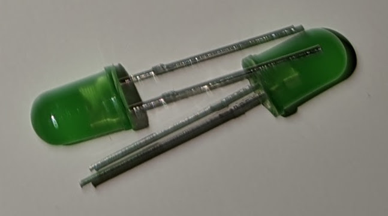

# 1904Labs Internet-of-Things Lunch And Learn Series!

This repository contains the slides and code for the 1904Labs Internet-of-Things Lunch And Learn Series!

Get your lunch and learn on with 1904Labs!

### What is this?

This is a series of lunch and learn sessions that we will be hosting at 1904Labs. The goal is to get people together to learn about various topics in the Internet-of-Things space. We will be covering a wide range of topics, from hardware to software to cloud services. We will also be covering a wide range of skills, from the basics to the advanced.

### Who is this for?

This is for anyone who is interested in learning about DIY Internet-of-Things. We will be covering a wide range of topics, so there should be something for everyone.

### What do I need to bring?

You will need your computer. [NodeJS](https://nodejs.org/en/) will need to be installed. I will be using [VSCode](https://code.visualstudio.com/) as our editor, but you can use whatever you want.

Everything else will be provided.

## The Kits

<table>
    <tr>
        <td></td>
        <td>Breadboard</td>
        <td>Keeps all the components in place</td>
    </tr>
    <tr>
        <td></td>
        <td>Arduino</td>
        <td>Our brains</td>
    </tr>
    <tr>
        <td></td>
        <td>White LED</td>
        <td>Our white light - needs a 51ohm resistor</td>
    </tr>
    <tr>
        <td></td>
        <td>Red LED</td>
        <td>Our red light - needs a 151ohm resistor</td>
    </tr>
    <tr>
        <td></td>
        <td>Green LED</td>
        <td>Our green light - needs a 151ohm resistor</td>
    </tr>
    <tr>
        <td></td>
        <td>Blue LED</td>
        <td>Our blue light - needs a 51ohm resistor</td>
    </tr>
    <tr>
        <td></td>
        <td>Yellow LED</td>
        <td>Our blue light - needs a 151ohm resistor</td>
    </tr>
    <tr>
        <td></td>
        <td>Buttons</td>
        <td>Our buttons, momentary switches</td>
    </tr>
    <tr>
        <td></td>
        <td>Potentiometer</td>
        <td>A rotating sensor, used to detect rotation</td>
    </tr>
    <tr>
        <td></td>
        <td>51 Ohm Resistors</td>
        <td>Resistors that we will use for blue and white LEDs</td>
    </tr>
    <tr>
        <td></td>
        <td>151 Ohm Resistors</td>
        <td>Resistors that we will use for red, green, and yellow LEDs</td>
    </tr>
    <tr>
        <td></td>
        <td>Vibrating Motor</td>
        <td>Small DC motor used for making things vibrate</td>
    </tr>
    <tr>
        <td></td>
        <td>USB C cable</td>
        <td>The cable we'll use to connect our arduino to our computer</td>
    </tr>
    <tr>
        <td></td>
        <td>Servo</td>
        <td>A 5v DC motor that is programmed to go to positions in degrees (1 - 180)</td>
    </tr>
    <tr>
        <td></td>
        <td>Piezo Buzzer</td>
        <td>A small speaker, used to play tones</td>
    </tr>
</table>

## Getting Started

### Prerequisites

You will need to have [NodeJS](https://nodejs.org/en/) and [Git](https://git-scm.com/) installed. I will be using [VSCode](https://code.visualstudio.com/) as our editor, but you can use whatever you want.

### Installing

Clone the repository

```
git clone git@github.com:ntatko/iot-lnl.git
cd iot-lnl
```

Install the dependencies

```
npm install
```

Then, plug in your arduino, using the provided USB cable. Make sure that the arduino is powered on (some lights will come on).

### Running

```
npm start
```

## Lesson Plan

### Is This Thing On?

In this lesson, your objective is to make the built-in LED on the arduino blink. You will be using the [Johnny-Five](http://johnny-five.io/) library to do this. The built-in LED on the arduino is connected to pin 13. 

*Cheat codes:* You can use the [blink](http://johnny-five.io/api/led/#blink) method to make the LED blink.

**Answer key:** [`ex1-it_works.js`](src/stages/ex1-it_works.js)

Or, if you just want to see the answer key in action:

```
node src/stages/ex1-it_works.js
```

### Push the Button

In this lesson, you will learn how to read the state of a button, and how to use that to control an LED.

Objective: Turn one LED on when the button is pressed, and have the other LED turn off when the button is pressed. Have them reverse when the button is released.


*Cheat codes:* You can use the [`on`](http://johnny-five.io/api/led/#on) method to turn the LED on, and the [`off`](http://johnny-five.io/api/led/#off) method to turn the LED off. [`toggle`](http://johnny-five.io/api/led/#toggle) might also be interesting.

**Answer key:** [`ex2-buttons_leds.js`](src/stages/ex2-buttons_leds.js)

Or, if you just want to see the answer key in action:

```
node src/stages/ex2-buttons_leds.js
```

### Spin the Dial

In this lesson, you will learn how to read the state of a potentiometer, and how to use that to control an LED.

Objective: Make an LED's brightness change based on the position of the potentiometer. Use whatever scale you want, linear, logarithmic, etc. Go nuts!


*Cheat codes:* You can use the [`brightness`](http://johnny-five.io/api/led/#brightness0255) method to set the brightness of the LED. The [`sensor`](http://johnny-five.io/api/sensor/) class is a good place to start using analog sensors. Be sure to use a pin that supports analog input - one preceded by an `'a'`.

**Answer key:** [`ex3-analog_pwm.js`](src/stages/ex3-analog_pwm.js)

Or, if you just want to see the answer key in action:

```
node src/stages/ex3-analog_pwm.js
```

### Make it Move

In this lesson, you will learn how to control a servo motor.

Objective: Make a servo motor move positions when a button is pressed.


*Cheat codes:* You can use the [`to`](http://johnny-five.io/api/servo/#to) method to move the servo to a specific position.

**Answer key:** [`ex4-servo.js`](src/stages/ex4-servo.js)

Or, if you just want to see the answer key in action:

```
node src/stages/ex4-servo.js
```

### Sing Along

In this lesson, you will learn how to control a piezo buzzer.

Objective: Make a piezo buzzer play a song when the program is run.


*Cheat codes:* Checkout the [`Piezo`](http://johnny-five.io/api/piezo/#tone) class for using these speakers.

**Answer key:** [`ex5-piezo.js`](src/stages/ex5-piezo.js)

Or, if you just want to see the answer key in action:

```
node src/stages/ex5-piezo.js
```
